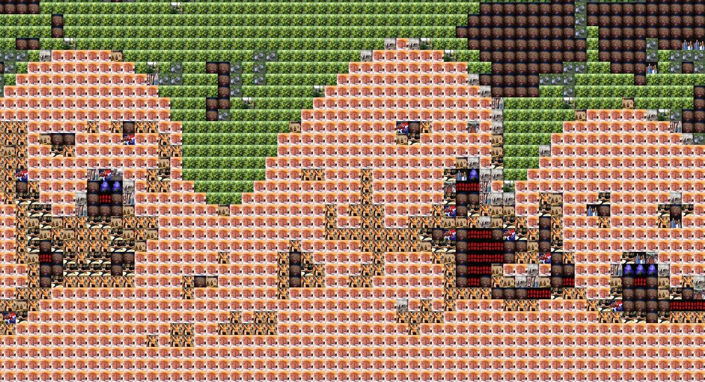

#Photo Mosaic

Specification

Created an app which allows a user to uplaod an image. It then connects to Flickr API to create a photo mosaic of the uploaded picture from recently uploaded Flickr photos.


(original image from http://feelgrafix.com/921990-yellow-labrador-puppies.html)


##Technologies used

Golang(core packages only)

git clone https://github.com/aitkenster/photo-mosaic.git

How to run it

[install Go](https://golang.org/doc/install)

```
cd photo-mosaic
go get
go run main.go
```

visit http://localhost:8080 to use the app

Future Improvements

- Testing (this was an experimental app)
- Styling
- Take an image URL as well as an uploaded image
- Filter on image types on Flickr feed
